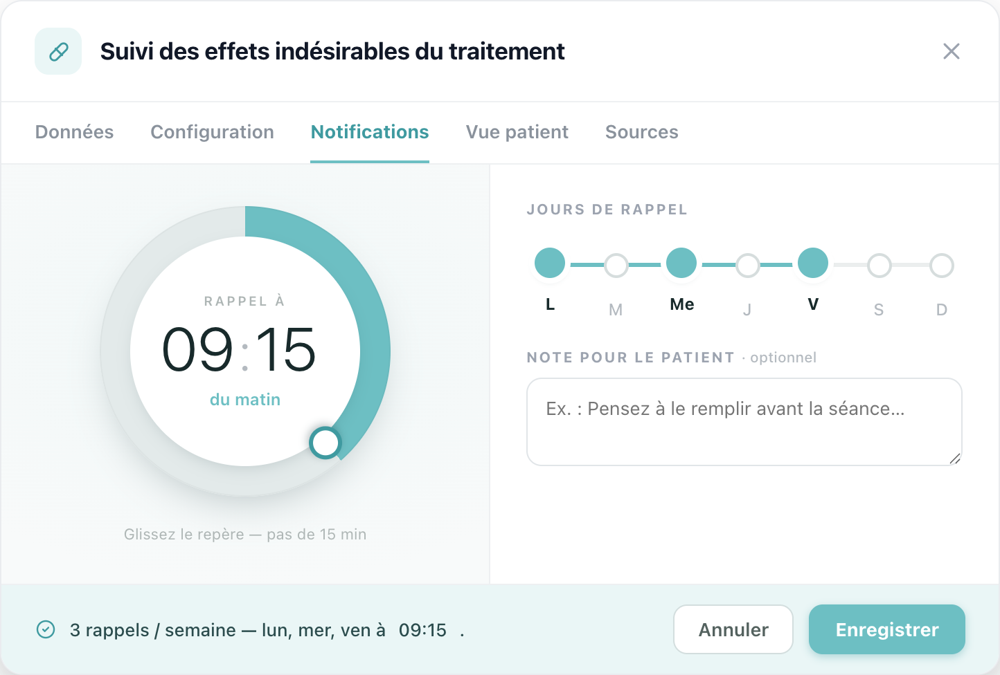

# Refonte du panneau « Notifications » : configuration d'un module (vue praticien)

> Spec versionnée du ticket de refonte. Surface concernée :
> `apps/web/src/components/features/NotificationRoutinePanel/`, monté dans l'onglet
> **Notifications** de `ModuleActionsModal` (vue praticien web).

## Contexte

L'onglet **Notifications** de la configuration d'un module est aujourd'hui une pile
verticale de champs génériques :

- **~50 % de vide** : segments Fréquence, pastilles de jours, champ heure et grande zone
  de note empilés sur toute la hauteur, sans densité ni hiérarchie.
- **Aucun lien avec le résultat** : rien ne montre ce que le patient reçoit réellement.
- **Réglage de l'heure pauvre** : un simple champ, sans lecture d'un coup d'œil du créneau.
- **Onglet actif en violet**, couleur orpheline du reste de l'app (teal de marque).

## Objectif

Faire du réglage du rappel un objet lisible et tangible : régler l'heure au geste **ou**
à la saisie, choisir les jours de façon rythmique, et lire le résumé en clair, le tout
dans le vocabulaire visuel existant (teal `#6dbfc3`, cartes blanches, `system-ui`).

## Direction retenue (maquette)

Référence maquette : option `4a` de `Notifications - config praticien.dc.html`.

### Composition

- **Cadran radial (colonne gauche)** : l'heure du rappel sur un anneau 24 h.
  - Arc teal proportionnel à l'heure (`conic-gradient`, 09:15 = fraction 0,385 de tour ;
    0 h en haut, sens horaire), repère blanc bordé teal positionné à l'angle correspondant.
  - **Deux champs saisissables au centre** (heures `:` minutes) : la saisie met à jour
    l'arc, le repère et le résumé en direct. Passage automatique du champ heures au champ
    minutes dès 2 chiffres (ou un chiffre > 2). Valeurs bornées (0 à 23 / 0 à 59), complétées
    à 2 chiffres à la perte de focus.
  - **Glisser le repère** ajuste l'heure par **pas de 15 min** et réécrit les champs.
  - Libellé « du matin / de l'après-midi / du soir » dérivé de l'heure.
- **Jours de rappel (colonne droite)** : sélecteur « ligne de la semaine », les 7 jours
  sur un rail continu, les jours actifs sont des arrêts pleins reliés par un fil teal.
  Lecture immédiate du rythme (vs cases isolées).
- **Note pour le patient** : champ texte optionnel, affiché dans la notification.
- **Barre de résumé (pied)** : « 3 rappels / semaine, lun, mer, ven à 09:15. » plus
  actions **Annuler** / **Enregistrer**. Le créneau se met à jour en direct.
- **Onglet actif unifié sur le teal** de la marque (au lieu du violet).

## Comportement

| Interaction | Résultat |
|---|---|
| Saisir les heures | Auto-focus des minutes à 2 chiffres (ou 1er chiffre > 2) |
| Saisir l'heure/minutes | Arc, repère et résumé mis à jour en direct |
| Glisser le repère | Heure par pas de 15 min ; champs réécrits |
| Cliquer un arrêt de jour | Active / désactive le jour ; le fil se recompose |
| Perte de focus d'un champ | Valeur bornée et complétée à 2 chiffres |

## Notes d'implémentation

- Source de vérité unique : l'heure en **minutes depuis minuit** ; l'arc (`m/1440` tour),
  l'angle du repère (`m/1440·360°`) et le texte en dérivent.
- Cadran non tactile : prévoir des cibles suffisantes pour le repère ; le glisser écoute
  `pointermove`/`pointerup` au niveau document.
- Accessibilité : les deux champs restent des `input` clavier (pas seulement le geste) ;
  prévoir des libellés associés (heures / minutes) et la navigation au Tab.
- Le champ minutes accepte la saisie libre (00 à 59) ; le pas de 15 min ne s'applique qu'au
  **glisser**. À confirmer : faut-il contraindre la saisie aussi à 15 min ?
- Réemploi du design system : ne pas réintroduire de `<button>` natif ni de style ad hoc là
  où un primitive `ui/` couvre le besoin (résumé/actions via `ui/Button`, champs via les
  primitives existants). Le cadran et la ligne de la semaine sont des composants nouveaux :
  les documenter dans `apps/web/docs/design-system.md` et les couvrir de tests.
- Zéro texte en dur : tout libellé passe par `t(...)` (clés `notifications.*` déjà en place).

## Hors périmètre

- Envoi réel des notifications (push / e-mail) et fuseaux horaires.
- Onglets Données, Configuration, Vue patient, Sources.

## À valider avant dev

- Contrainte 15 min sur la saisie manuelle, ou saisie libre ?
- Fréquences « Tous les jours » / « Jours ouvrés » : réintroduire un raccourci, ou tout
  passer par la ligne de la semaine ?
