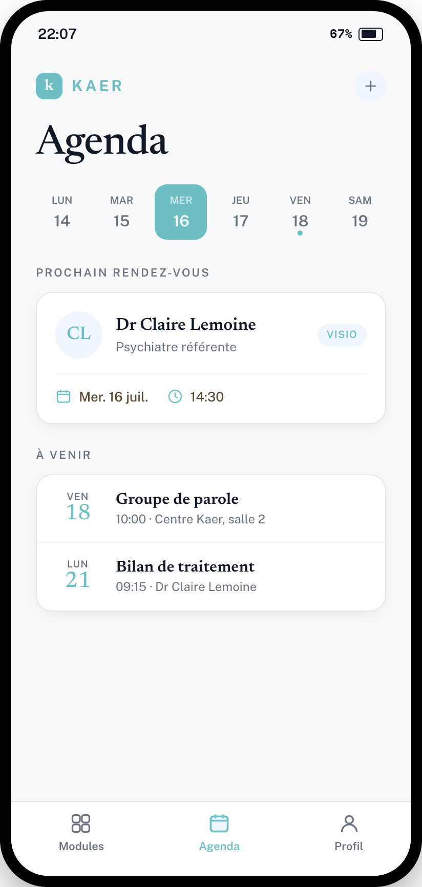

# Refonte — Écran « Agenda » (patient)

> **Type** : Refonte UI · **App** : Kaer (patient) · **Priorité** : Haute
> **Direction retenue** : 3a — liste-registre, palette officielle Kaer (turquoise / blanc)

---

## Contexte

Vue des rendez-vous et consultations à venir, cohérente avec l'accueil refondu. Même grammaire visuelle : cartes blanches détachées, accents turquoise, typo éditoriale.

## Objectifs

- Mettre en avant le **prochain rendez-vous** sans surcharge.
- Navigation temporelle claire (bande semaine).
- Réutiliser les primitives existantes (`WeekGrid`, `AppointmentModal`, `Card`, `StatusBadge`).

## Palette

Identique à l'écran Modules (tokens `:root`). Accent = `--color-primary`. Badge « Visio » = pattern info (`--color-primary-light` / `--color-primary`).

## Structure

1. **En-tête** marque + action (ajout `+`, `--color-primary-light`).
2. **Titre** : « Agenda », serif ~40px.
3. **Bande semaine** : 6–7 jours, jour sélectionné en pastille pleine `--color-primary` (texte blanc, sous-label `#CFE9EA`) ; point d'événement `--color-primary` sous les jours concernés.
4. **Prochain rendez-vous** (label de section muted) : carte blanche = avatar praticien (initiales, `--color-primary-light`), nom serif, rôle muted, badge « Visio » à droite ; pied séparé par filet avec date + heure (icônes turquoise).
5. **À venir** : liste-registre (conteneur unique, filets internes) — chaque ligne = bloc date (jour abrégé muted + numéro serif turquoise) + titre + détail muted.
6. **Barre d'onglets** : Agenda actif (pastille `--color-primary-light`, icône + label turquoise).

## Spécifications composants

- **Bande semaine** : mappe `features/WeekGrid` ; jour actif = `background --color-primary`, radius `12px`.
- **Carte RDV** : `Card` variant `elevated` ; badge = `StatusBadge variant="info"` ou `Chip tone="info"`.
- **Liste « À venir »** : même conteneur liste-registre que les modules (border, radius 16px, shadow, filets `#F3F4F6`).
- Ouverture d'un RDV → `AppointmentModal` existant.

## Accessibilité

- Texte informatif ≥ AA. Badge « Visio » suit le pattern info du DS (contraste à surveiller comme sur l'app réelle).
- Pastille jour sélectionné : blanc sur `--color-primary` — vérifier ≥ 4.5:1 (sinon foncer le turquoise de fond du jour actif).
- Cibles tactiles ≥ 44px (jours de la bande semaine inclus).

## Critères d'acceptation

- [ ] Prochain RDV mis en avant, badge de modalité (Visio/présentiel).
- [ ] Bande semaine navigable, jour actif et points d'événement lisibles.
- [ ] Liste « À venir » cohérente avec la liste-registre des modules.
- [ ] Primitives réutilisées (WeekGrid, Card, StatusBadge, AppointmentModal).
- [ ] Contrastes AA vérifiés.
