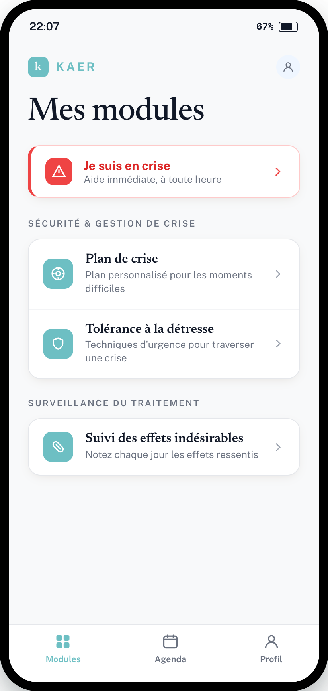

# Refonte — Écran « Mes modules » (accueil patient)

> **Type** : Refonte UI · **App** : Kaer (patient) · **Priorité** : Haute
> **Direction retenue** : 3a — liste-registre, palette officielle Kaer (turquoise / blanc)

---

## Contexte

L'accueil patient actuel fait « template IA » : hiérarchie plate, icônes ton sur ton, cartes indistinctes du fond. Cette refonte pose une direction éditoriale sobre et crédible (médical), tout en gardant la palette de marque en place.

## Objectifs

- Rendre l'app crédible et rassurante, sans dramatiser.
- Bouton de crise **présent et clair**, jamais alarmant.
- Distinction nette cartes / fond, contrastes accessibles.

## Palette (tokens `:root` existants — ne pas hardcoder)

| Token | Valeur | Usage |
|---|---|---|
| `--color-primary` | `#6dbfc3` | Accents, puces d'icône, marque |
| `--color-primary-light` | `#EFF6FF` | Fonds de puce d'icône (line-icons) |
| `--color-background` | `#F8F9FA` | Fond d'écran |
| `--color-card` | `#FFFFFF` | Cartes |
| `--color-text` | `#111827` | Titres et texte principal |
| `--color-text-muted` | `#6B7280` | Sous-titres, labels de section |
| `--color-border` | `#E5E7EB` | Bordures de carte |
| `--color-danger` | `#EF4444` | Crise (accent, icône) ; texte crise `#DC2626` |
| `--color-danger-light` | `#FEE2E2` | Fonds crise / déconnexion |

## Structure

1. **En-tête** : marque « kaer » (logo + wordmark turquoise, `letter-spacing .16em`, uppercase) + bouton profil rond (`--color-primary-light`).
2. **Titre** : « Mes modules », serif éditorial, ~40px.
3. **Bandeau crise** : carte blanche, filet gauche `4px` danger, puce d'icône pleine danger + icône blanche, titre `#DC2626`, sous-titre muted, chevron. Toujours en tête, sous le titre.
4. **Groupes de modules** par section, chacun précédé d'un label uppercase muted :
   - *Sécurité & gestion de crise* → Plan de crise · Tolérance à la détresse
   - *Surveillance du traitement* → Suivi des effets indésirables
5. **Barre d'onglets** : Modules (actif) · Agenda · Profil.

## Spécifications composants

- **Carte de section** = conteneur unique blanc, `border 1px --color-border`, `border-radius 16px`, `box-shadow` douce ; lignes de module séparées par un filet `1px #F3F4F6` (pas de cartes individuelles).
- **Ligne de module** : puce d'icône `38×38`, `border-radius 11px`, fond `--color-primary`, icône blanche `1.9` stroke → **plein, contrasté** (fini le ton sur ton). Titre serif `16.5px`, sous-titre muted `12.5px`, chevron `#9CA3AF`.
- **Bandeau crise** : réutilise le pattern `Banner`/carte, variante danger, filet gauche. Ne jamais utiliser de rouge plein en fond.

## Accessibilité

- Texte informatif ≥ AA (4.5:1) : titres `#111827`, sous-titres/labels `#6B7280` sur blanc/`#F8F9FA`.
- Titre crise `#DC2626` sur blanc ≈ 4.9:1.
- ⚠️ Onglet actif en `--color-primary` sur blanc : contraste faible pour le label — à arbitrer (foncer le turquoise du texte tout en gardant le token d'accent pour la puce/pastille).
- Cibles tactiles ≥ 44px.

## Critères d'acceptation

- [ ] Palette 100 % issue des tokens `:root`, zéro hex en dur.
- [ ] Icônes pleines contrastées, cartes nettement détachées du fond.
- [ ] Bandeau crise présent en tête, lisible, non alarmant.
- [ ] Contrastes texte AA vérifiés.
- [ ] Barre d'onglets fonctionnelle (Modules / Agenda / Profil).
