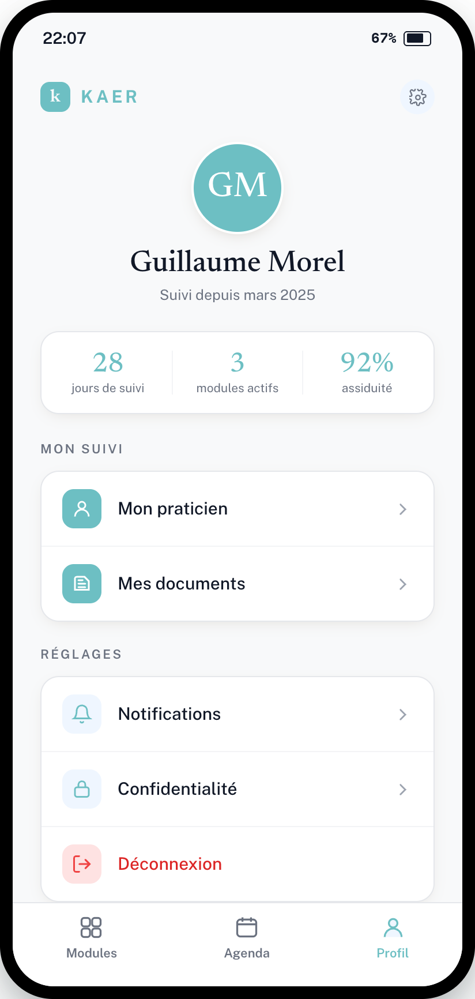

# Refonte — Écran « Profil » (patient)

> **Type** : Refonte UI · **App** : Kaer (patient) · **Priorité** : Haute
> **Direction retenue** : 3a — liste-registre, palette officielle Kaer (turquoise / blanc)

---

## Contexte

Espace personnel : identité, résumé de suivi, accès praticien / documents, réglages. Même direction visuelle que Modules et Agenda.

## Objectifs

- Identité claire et rassurante en tête.
- Résumé de suivi lisible en un coup d'œil (stats neutres, aucune interprétation clinique — conformité MDR).
- Réglages regroupés en liste-registre.

## Palette

Identique aux autres écrans (tokens `:root`). Déconnexion = danger (`#DC2626` texte, `--color-danger-light` fond de puce).

## Structure

1. **En-tête** marque + accès réglages (roue crantée, muted).
2. **Bloc identité** (centré) : avatar rond `76px` **fond `--color-primary`, initiales blanches** (pendant du `ProfileDropdown` web), bordure blanche + ombre ; nom serif ~26px ; ligne muted « Suivi depuis … ».
3. **Résumé de suivi** : carte blanche à 3 colonnes séparées par filets — chiffre serif turquoise + libellé muted (ex. jours de suivi · modules actifs · assiduité). **Valeurs brutes, neutres**, aucun code couleur de gravité.
4. **Mon suivi** (label muted) : liste-registre — Mon praticien · Mes documents (puces d'icône pleines turquoise).
5. **Réglages** (label muted) : liste-registre — Notifications · Confidentialité (puces d'icône `--color-primary-light` + line-icon turquoise) · **Déconnexion** (puce danger, texte `#DC2626`, sans chevron).
6. **Barre d'onglets** : Profil actif.

## Spécifications composants

- **Avatar** : réutiliser le traitement `ProfileDropdown` (fond primary, initiales blanches).
- **Carte stats** : `Card` ; colonnes séparées par `1px #F3F4F6` ; aucune sémantique de seuil sur les chiffres.
- **Listes** : même conteneur liste-registre (border, radius 16px, shadow, filets internes).
- **Déconnexion** : ligne d'action danger (puce `--color-danger-light` + icône `--color-danger`), texte `#DC2626`.

## Accessibilité

- Avatar : blanc sur `--color-primary` (décoratif, grand) — OK.
- Texte informatif ≥ AA (titres `#111827`, muted `#6B7280`).
- Déconnexion `#DC2626` sur blanc ≈ 4.9:1.
- Cibles tactiles ≥ 44px.

## Conformité MDR

- Les statistiques de suivi sont **descriptives** : couleur = identité, jamais gravité. Aucun agrégat interprétatif ni seuil coloré.

## Critères d'acceptation

- [ ] Identité en tête (avatar primary + initiales blanches, nom, ancienneté).
- [ ] Résumé de suivi neutre, 3 stats brutes.
- [ ] Sections « Mon suivi » et « Réglages » en liste-registre.
- [ ] Déconnexion traitée en danger, isolée en bas.
- [ ] Palette 100 % tokens, contrastes AA vérifiés.
